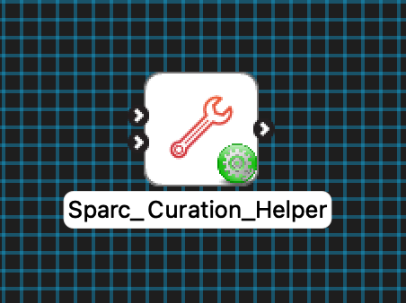
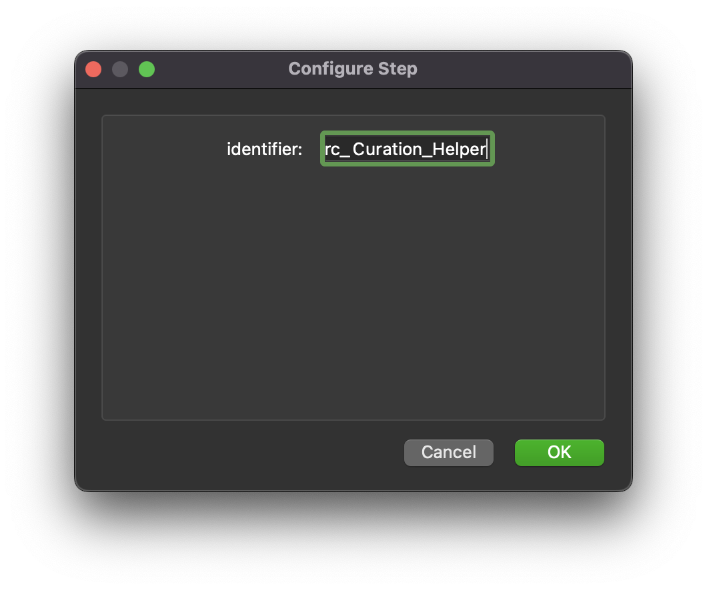
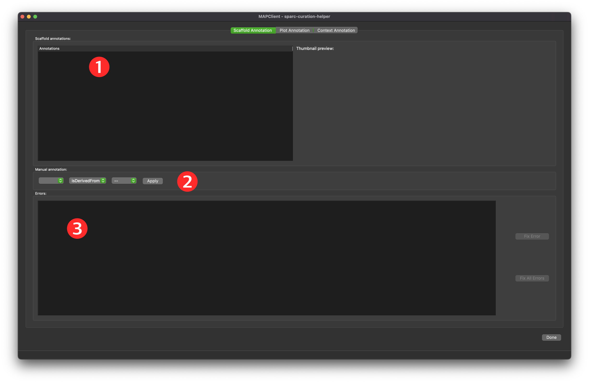
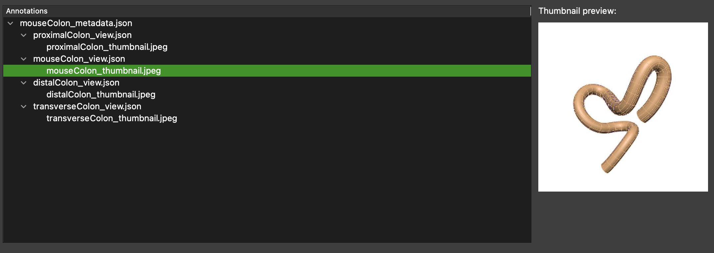
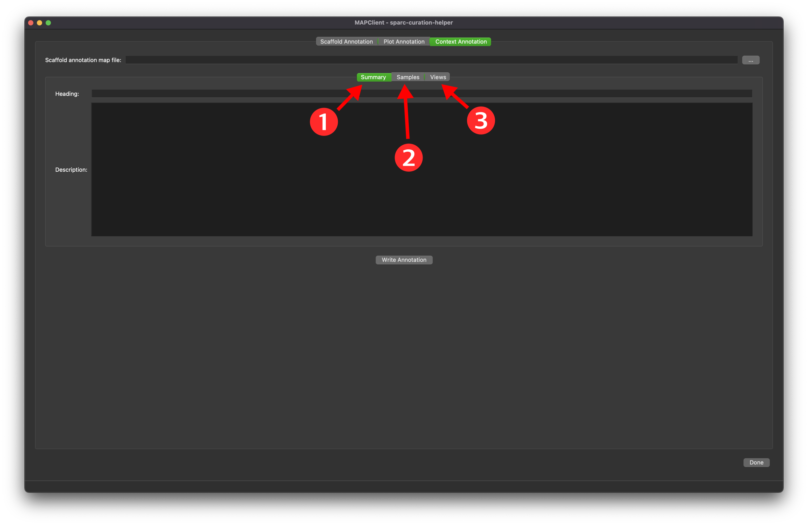
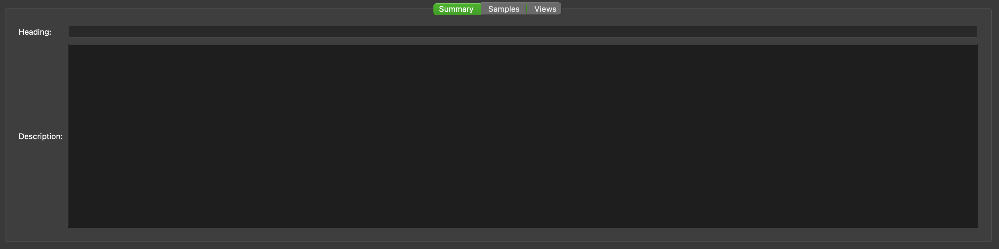
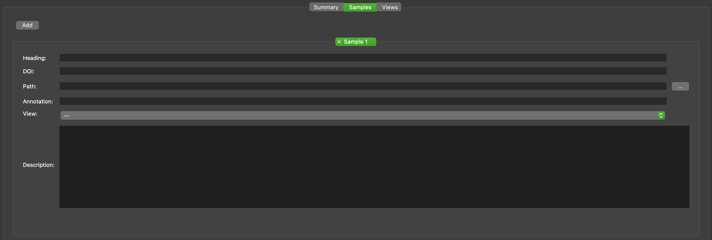
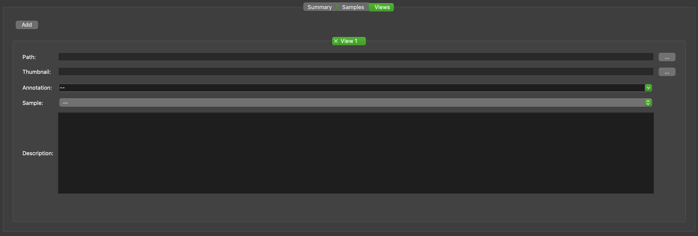

MAP Client Plugin - SPARC Curation Helper
=========================================

The **SPARC Curation Helper** is a MAP Client plugin for curating SPARC datasets.

.. _fig-mcp-sparc-curation-helper-configured-step:

   A configured *SPARC Curation Helper* step icon.

**Table of contents**

* :ref:`hdg-mcp-sparc-curation-helper-configure`
* :ref:`hdg-mcp-sparc-curation-helper-ports`
* :ref:`hdg-mcp-sparc-curation-helper-user-interface`

  * :ref:`hdg-mcp-sparc-curation-helper-scaffold-annotation`
  * :ref:`hdg-mcp-sparc-curation-helper-plot-annotation`
  * :ref:`hdg-mcp-sparc-curation-helper-context-annotation`

.. _hdg-mcp-sparc-curation-helper-configure:

Configure
---------

This step comes pre-configured but there are a few parameters to modify the behaviour of the step.
The output directory should be set to a location outside of the current workflow directory.

.. _fig-mcp-sparc-curation-helper-configure-dialog:

   *SPARC Curation Helper* step configuration dialog.

The *Consolidate Resources* option is for making sure all external resources referenced in the document are copied to the same directory as the Argon document itself.
The purpose of this parameter is to make sharing Argon documents and their resources easier.

.. _hdg-mcp-sparc-curation-helper-ports:

Ports
-----

This plugin:

* **uses**:

  * *https://opencmiss.org/1.0/rdf-schema#directory_location*
  * *https://opencmiss.org/1.0/rdf-schema#file_location*

and

* **provides**:

  * *https://opencmiss.org/1.0/rdf-schema#file_location*

.. _hdg-mcp-sparc-curation-helper-user-interface:

User Interface
--------------

The SPARC dataset curation helper step consists of the **Scaffold Annotation**, **Plot Annotation**, and the **Context Annotation** tabs.

.. _hdg-mcp-sparc-curation-helper-scaffold-annotation:

Scaffold Annotation
+++++++++++++++++++

With regard to the Scaffold Annotation tab, there are three main sections:

1. first is the Scaffold annotations section that reports on the currently available scaffold annotations,
2. the second section is the Manual annotation section which helps to manually annotate the metadata files, view files, and the thumbnail files (note that it’s only for annotating with the isDerivedFrom and isSourceOf predicates),
3. and the third section named Errors is where error reporting is shown and where errors can be fixed.

.. _fig-mcp-sparc-curation-helper-initial-interface-dialog:

   *SPARC Curation Helper* initial interface with the three main sections of the scaffold annotation interface indicated by a numbered circle.

The manual annotation should be used with extreme caution.
It is very easy to make nonsensical statements that will harm computer understanding of the dataset.
The automatic annotation tool in the Errors section will work in 99% of cases and should alleviate the need for using the manual annotation functionality.

In the errors section we will see any errors listed about the current scaffold annotation.
When the plugin is loaded it automatically scans the dataset and checks for annotation errors.
This means we can already have errors showing when we first see the user interface.
We can fix these errors using the **Fix All Errors** button.
Clicking on the **Fix All Errors** button will pop-up a confirmation dialog, click the **Yes** button to allow the magic tool to fix errors.
Alternatively, click the **No** button to cancel the fixing of errors.

.. note::

  The curation helper tool works on one layer of errors at a time.
  When we fix one layer of errors the next layer may have more errors than the previous layer.
  This means, when we use the **Fix All Errors** button, we can have more errors than what we started with.
  So, you may have to use the **Fix All Errors** button multiple times, until the tool stops reporting new errors.
  If the reported errors are not changing then we need to use the manual annotation tool to make the correct annotations.

.. _fig-mcp-sparc-curation-helper-annotated-scaffold-dialog:

   *SPARC Curation Helper* annotated scaffold dataset, a thumbnail image is selected in the annotations tree listing and the corresponding image is shown to the right.

.. _hdg-mcp-sparc-curation-helper-plot-annotation:

Plot Annotation
+++++++++++++++

.. note::

  At the time of writing the plot annotation interface has not been released.
  This work is expected to be ready for release in the near future.

.. _hdg-mcp-sparc-curation-helper-context-annotation:

Context Annotation
++++++++++++++++++

The **Context Annotation** allows us to add additional contextual information to the visualization of the scaffold.

At the top of the **Context Annotation** tab, there is a provision to manually select a scaffold annotation map file.
However, when the dataset already has a scaffold annotation map file saved within it, the scaffold annotation tool will automatically load this file for us.
If you did want to add additional annotations you can load them using the select scaffold annotation map file functionality.

The context annotation tab is subdivided into three parts; *Summary*, *Samples*, and *Views*.
We should always enter details in the *Summary* section.
And depending on the dataset, we should make some addition in at least one of the *Samples* or *Views* parts.

.. _fig-mcp-sparc-curation-helper-context-annotation-initial-dialog:

   *SPARC Curation Helper* context annotation, the three parts to the context annotation are indicated.

Summary
#######

The *Summary* part has the provision for adding a *Title* and a longer *Description*.
The *Title* is the main title that covers the whole of the contextual information.
The *Description* covers details about the dataset that aren't covered by either the *Samples* or *Views* parts.

.. _fig-mcp-sparc-curation-helper-summary-tab-dialog:

   *SPARC Curation Helper* context information summary tab.

Sample
######

The *Sample* part adds references to sample data mapped to the scaffold.
The *Add* button creates a new sample entry.
Each sample that has contextual information will have its own entry.

For a sample the following information can be set:

* A heading,
* A DOI,
* A path,
* An annotation,
* A view reference; and
* A description

The *Heading* is a simple text description of the sample.
The *DOI* is a reference to the source of the sample.
If the source of the sample is the current location then this parameter is left blank.
The *Path* is a relative path from the root of the dataset the sample is found in.
The *Annotation* parameter is a free form field for adding annotations, for example UBERON:00072.
No checks are performed on the validity of the annotations.
The *View* chooser is used to link a sample to a view, and vice-versa.
The *Description* is a field for a more complete description of the sample than what the *heading* allows.

.. _fig-mcp-sparc-curation-helper-sample-tab-dialog:

   *SPARC Curation Helper* context information samples tab, the samples tab showing the addition of an empty sample.

View
####

The *View* part adds information on a view of the scaffold.
The *Add* button creates a new view entry.
Each view that has contextual information will have its own entry.

For a view the following information can be set:

* A path,
* A thumbnail,
* An annotation,
* A sample reference; and
* A description

The *Path* is a relative path from the root of the dataset the view is found in.
The *Thumbnail* is a relative path from the root of the dataset to the thumbnail for the view.
The *Annotation* parameter is a free form field for adding annotations, for example UBERON:00072.
Any annotations found with the scaffold will be pre-loaded into the annotation chooser.
The *Sample* chooser is used to link a view to a sample, and vice-versa.
The *Description* is a field for a complete description of the view.

.. _fig-mcp-sparc-curation-helper-view-tab-dialog:

   *SPARC Curation Helper* context information view tab, the view tab showing the addition of an empty view.
